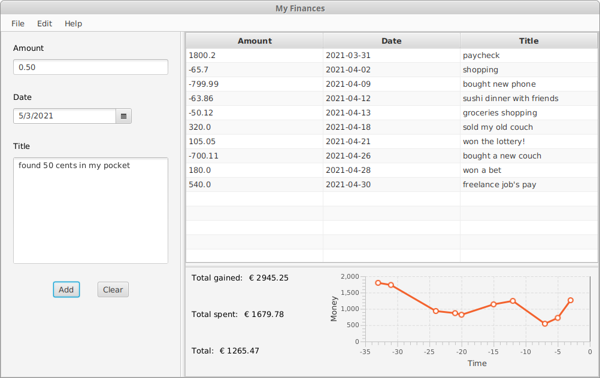
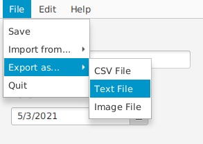

# FINANCES TRACKER

# Description

I created this app to keep track of my monthly income and expenses. 
It displays a list of [Transactions](src/main/java/resources/Transaction.java) in a table so that I can easily see how I've been managing my finances.

Every Transaction has 3 attributes:
+ the amount of money spent/gained
+ the date on which it happened
+ a short description of where that money came from or went to

-----

# How it looks

On the left there's a section in which the user can create and add a new Transaction to the list. 
The **title** is not required but highly recommended in order to remember what the various transactions are for. 
Under the main table there's a small text section which shows the definitive counters and a **Line Chart** that helps in
better visualizing the changes over time.

-----

# Handling Data

The application lets the user save the current state to a binary file with the "**Save**" button. 
The following time the application is started, it will automatically load the data from that same file.

They can, nonetheless, export the data to either a **.csv** or **.txt** file that can later be imported back. 
If they choose, they can even save the current state of the graph as a **.png** image. 
All this can be done with the "**Export as...**" and "**Import from...**" buttons.

